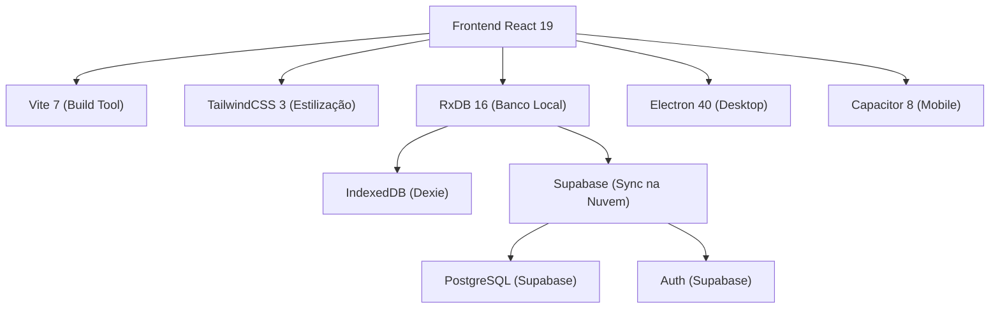
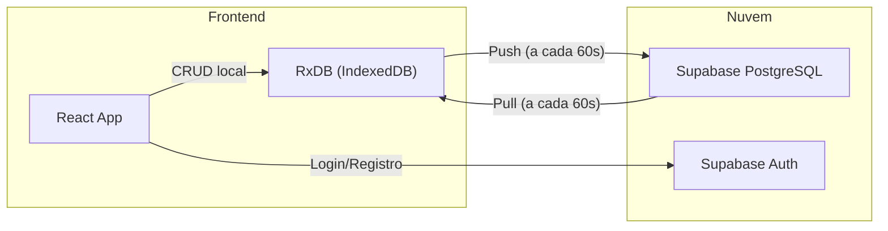
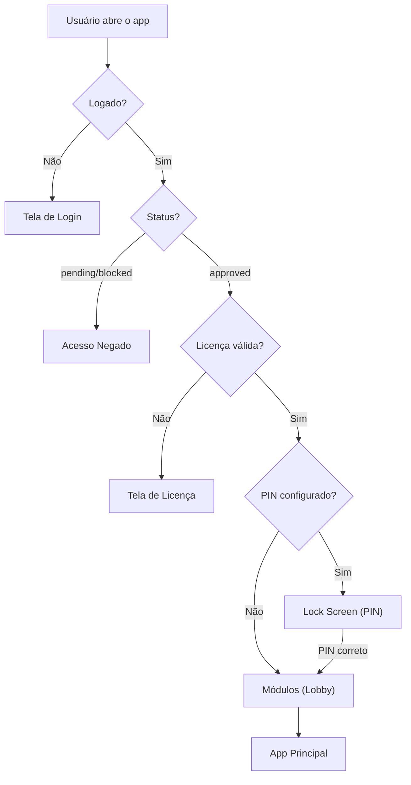

# 📦 Evobit — Apresentação Completa do Projeto

> **Sistema de Controle de Estoque e Vendas**
> Versão: 0.1.0 | Última atualização: Março 2026

---

## 1. Visão Geral

O **Evobit** é um sistema completo de gestão de estoque projetado para pequenos e médios negócios. Ele funciona como aplicativo **desktop** (Windows/Mac/Linux via Electron), **web** (navegador) e **mobile** (Android/iOS via Capacitor), com suporte completo a **modo offline**.

### Principais Diferenciais

| Recurso | Descrição |
|---------|-----------|
| 🔌 **Offline-First** | Funciona sem internet. Sincroniza automaticamente quando conecta |
| 📱 **Multiplataforma** | Desktop (Electron), Web e Mobile (Capacitor) |
| 🔐 **Segurança Zero Trust** | RLS no banco, autenticação Supabase, PIN de segurança |
| 👥 **Multi-Usuário** | Sistema de equipes com papéis (Dono, Admin, Funcionário) |
| 🌍 **Multi-Idioma** | Português, Inglês e Espanhol |
| 📷 **Scanner de Código** | Câmera + Leitor USB/Bluetooth |

---

## 2. Stack Tecnológica



### Dependências Principais

| Pacote | Versão | Função |
|--------|--------|--------|
| `react` | 19.2 | Framework UI |
| `react-router-dom` | 7.13 | Navegação entre telas |
| `rxdb` | 16.21 | Banco de dados local (offline-first) |
| `@supabase/supabase-js` | 2.95 | Backend, Auth e Sync na nuvem |
| `electron` | 40.2 | Empacotamento desktop |
| `@capacitor/core` | 8.0 | Empacotamento mobile |
| `recharts` | 3.7 | Gráficos do Dashboard |
| `lucide-react` | 0.469 | Ícones |
| `html5-qrcode` | 2.3 | Scanner de códigos de barras |
| `xlsx` | 0.18 | Importação/Exportação Excel |
| `sonner` | 2.0 | Notificações toast |
| `framer-motion` | 12.33 | Animações |
| `tailwind-merge` + `clsx` | — | Utilitários CSS |

---

## 3. Estrutura de Pastas

```
evobit-desktop/
├── electron/               # Configuração Electron (desktop)
│   ├── main.cjs            # Processo principal do Electron
│   └── preload.js          # Script de preload
│
├── src/
│   ├── App.jsx             # Rotas e providers raiz
│   ├── main.jsx            # Entry point React
│   ├── index.css           # Estilos globais + custom scrollbar
│   ├── ErrorBoundary.jsx   # Captura de erros global
│   │
│   ├── pages/              # ⭐ Telas da aplicação
│   │   ├── Login.jsx           # Tela de login
│   │   ├── Register.jsx        # Tela de cadastro
│   │   ├── ForgotPassword.jsx  # Recuperação de senha
│   │   ├── UpdatePassword.jsx  # Atualização de senha
│   │   ├── AccessDenied.jsx    # Acesso negado (pending/blocked)
│   │   ├── Modules.jsx         # Seleção de módulos (lobby)
│   │   ├── GeneralDashboard.jsx# Dashboard consolidado
│   │   ├── Dashboard.jsx       # Visão geral de múltiplos dados
│   │   ├── Products.jsx        # Catálogo de produtos (CRUD)
│   │   ├── Categories.jsx      # Gestão de categorias
│   │   ├── Recipes.jsx         # Receitas (composições de produtos)
│   │   ├── Inventory.jsx       # Controle de estoque focado
│   │   ├── Movements.jsx       # Entradas e saídas
│   │   ├── Providers.jsx       # Fornecedores (CRUD)
│   │   ├── Customers.jsx       # Clientes (CRUD)
│   │   ├── History.jsx         # Histórico de movimentações
│   │   ├── Reports.jsx         # Módulo avançado de relatórios
│   │   ├── Sales.jsx           # Vendas (Módulo Desativado)
│   │   ├── SalesDashboard.jsx  # Dashboard de Vendas
│   │   ├── Purchases.jsx       # Compras (Módulo Desativado)
│   │   ├── PurchasesDashboard.jsx # Dashboard de Compras
│   │   ├── Orders.jsx          # Gestão de Pedidos
│   │   ├── Finance.jsx         # Financeiro (Módulo Desativado)
│   │   ├── FinanceDashboard.jsx# Dashboard Financeiro
│   │   ├── LicenseSettings.jsx # Configurações de Licença
│   │   ├── CompanySettings.jsx # Configurações da empresa
│   │   ├── TeamSettings.jsx    # Gerenciamento de equipe
│   │   └── Admin.jsx           # Painel administrativo
│   │
│   ├── components/
│   │   ├── layout/
│   │   │   └── Layout.jsx      # Layout principal (sidebar + header)
│   │   ├── ui/
│   │   │   ├── Button.jsx      # Botão reutilizável
│   │   │   ├── Card.jsx        # Card com glassmorphism
│   │   │   ├── Input.jsx       # Input estilizado
│   │   │   ├── Modal.jsx       # Modal overlay
│   │   │   └── BarcodeScanner.jsx  # Scanner de código de barras
│   │   ├── auth/
│   │   │   └── LockScreen.jsx  # Tela de bloqueio (PIN)
│   │   └── shared/
│   │       ├── LicenseGuard.jsx    # Verificação de licença
│   │       └── DataImporter.jsx    # Importador de dados Excel
│   │
│   ├── contexts/           # Gerenciamento de estado global
│   │   ├── AuthContext.jsx     # Autenticação (Supabase Auth)
│   │   ├── LanguageContext.jsx # Traduções PT/EN/ES
│   │   ├── ThemeContext.jsx    # Tema e preferências visuais
│   │   └── SecurityContext.jsx # PIN de segurança
│   │
│   ├── db/                 # Banco de dados local
│   │   ├── database.js     # Inicialização do RxDB
│   │   ├── schema.js       # Schemas das coleções
│   │   └── sync.js         # Sincronização RxDB ↔ Supabase
│   │
│   ├── services/           # Camada de serviços
│   │   ├── api.js          # CRUD local (RxDB)
│   │   ├── backup.js       # Backup/Restore de dados
│   │   └── license.js      # Sistema de licenciamento
│   │
│   ├── lib/
│   │   └── supabaseClient.js # Cliente Supabase configurado
│   │
│   └── utils/
│       └── formatters.js   # Formatadores (moeda, data, etc.)
│
├── supabase/
│   └── schema.sql          # Schema completo do banco na nuvem
│
├── package.json
├── vite.config.js
├── tailwind.config.js
└── capacitor.config.json
```

---

## 4. Telas da Aplicação

### 4.1 🔐 Login e Autenticação

| Tela | Rota | Descrição |
|------|------|-----------|
| **Login** | `/login` | Email + Senha via Supabase Auth |
| **Cadastro** | `/register` | Criação de conta nova |
| **Esqueci Senha** | `/forgot-password` | Reset via email |
| **Atualizar Senha** | `/update-password` | Nova senha após reset |
| **Acesso Negado** | `/access-denied` | Usuários pendentes ou bloqueados |

O fluxo de autenticação é:
1. Usuário faz login → Supabase Auth valida credenciais
2. Se `status = pending/blocked` → redireciona para `/access-denied`
3. Se aprovado → entra no sistema protegido pelo `LicenseGuard`

### 4.2 📋 Módulos (Lobby)

| Rota: `/modules` |
|---|

Tela de seleção de módulos. Funciona como um "lobby" onde o usuário escolhe qual área do sistema deseja acessar. Serve como porta de entrada após o login.
**Atenção:** Os módulos de **Vendas**, **Compras** e **Financeiro** estão atualmente desativados (bloqueados no `ModuleContext`) para priorizar o foco na gestão de Estoque.

### 4.3 📊 Dashboard (Visão Geral)

| Rota: `/app/dashboard` |
|---|

A tela principal com inteligência de dados:

- **4 KPIs principais:**
  - 💰 Patrimônio em Estoque (cálculo de valor total unificado)
  - ⏳ Validade Próxima (itens vencendo em 30 dias)
  - ⚠️ Alerta de Estoque (produtos abaixo do mínimo)
  - 📈 Movimentações no período

- **Gráficos:**
  - 📉 Entradas e Saídas no período (Line Chart)
  - 🍩 Distribuição por categorias (Pie Chart)
  - 📊 Top produtos movimentados (Bar Chart)
  - 📋 Atividade recente

- **Filtros:**
  - Por categoria (Revenda, Limpeza, Consumo, Outro)
  - Por período (7, 30, 90 dias, mês atual, mês anterior)

### 4.4 📦 Produtos

| Rota: `/app/produtos` |
|---|

CRUD completo de produtos com:

- **Listagem** em modo lista ou grade
- **Busca** por nome, SKU ou marca
- **Filtros** por estoque (Todos / Baixo) e categoria
- **Ordenação** por qualquer coluna
- **Formulário** com: Nome, Marca, Código de Barras, Categoria, Unidade, Estoque Mínimo, Data de Validade
- **Detalhes Aprimorados:** Visualização rápida do último fornecedor do produto
- **Scanner** de código de barras (câmera + USB)
- **Importação** de dados via Excel
- **Exportação** para Excel

### 4.5 🏪 Estoque

| Rota: `/app/estoque` |
|---|

Visão operacional do estoque com todas as funcionalidades de Produtos, mais:

- **Filtro de validade** (produtos vencendo)
- **Impressão** de relatório de estoque baixo
- **Alertas visuais** para itens críticos (vermelho) e em alerta (amarelo)
- **Formulário inline** para cadastro rápido

### 4.6 🔄 Movimentações

| Rota: `/app/movimentacoes` |
|---|

A tela mais complexa — gerencia entradas e saídas:

- **Sistema de cesta:** Adiciona múltiplos itens antes de confirmar
- **Tipo:** Entrada ou Saída
- **Motivo da saída:** Venda, Consumo Interno, Perda, Devolução, Validade, etc.
- **Campos:** Produto, Quantidade, Preço, Fornecedor, Validade, Observações
- **Scanner** de código de barras integrado
- **Busca rápida** de produtos
- **Validação:** Não permite saída maior que estoque disponível
- **Transação atômica:** Todos os itens da cesta são processados juntos

### 4.7 🏢 Fornecedores

| Rota: `/app/fornecedores` |
|---|

CRUD de fornecedores com:

- Nome, CNPJ, Telefone, Email, Endereço
- Busca e filtros
- Importação/Exportação Excel

### 4.8 📜 Histórico

| Rota: `/app/historico` |
|---|

Log de todas as movimentações realizadas, com informações de data/hora, tipo, produto, quantidade e responsável.

### 4.9 📄 Relatórios

| Rota: `/app/relatorios` |
|---|

Módulo de análise e consolidação de dados:

- **Estatísticas** e tabelas personalizadas
- **Exportação** avançada (Excel / PDF) - *em aprimoramento contínuo*
- Filtros por períodos e categorias abrangentes

### 4.10 ⚙️ Configurações

| Rota: `/app/configuracoes` |
|---|

- **Dados da Empresa:** Nome, logo, informações de contato
- **Idioma:** Português, Inglês, Espanhol
- **Moeda:** Real, Dólar, Euro, etc.
- **Tema:** Personalização de cores
- **PIN de Segurança:** Bloqueio do app com código PIN
- **Backup:** Exportar/Importar dados

### 4.11 👥 Equipe

Gerenciamento de membros da equipe:

- **Convidar** membros por email
- **Papéis:** Admin ou Employee
- **Remover** membros

### 4.12 🛡️ Painel Admin

| Rota: `/admin` (protegido) |
|---|

Painel exclusivo para administradores do sistema:

- Gerenciamento de usuários
- Aprovar/bloquear contas
- Controle de acesso

---

## 5. Banco de Dados

### 5.1 Arquitetura: Offline-First com Sincronização



O app funciona com **dois bancos de dados**:

| Banco | Tecnologia | Função |
|-------|-----------|--------|
| **Local** | RxDB + IndexedDB (Dexie) | Operações do dia-a-dia (offline) |
| **Nuvem** | Supabase (PostgreSQL) | Backup, sincronização, autenticação |

### 5.2 Coleções Locais (RxDB)

#### `products`

| Campo | Tipo | Descrição |
|-------|------|-----------|
| `id` | string (UUID) | Identificador único |
| `name` | string | Nome do produto (**obrigatório**) |
| `brand` | string | Marca |
| `barcode` | string | Código de barras |
| `category` | string | Categoria (REVENDA, LIMPEZA, CONSUMO, OUTRO) |
| `unit` | string | Unidade (UN, KG, LT, CX, PCT) |
| `description` | string | Descrição do produto |
| `price` | number | Preço de venda (**obrigatório**) |
| `min_stock` | number | Estoque mínimo para gerar alerta |
| `current_stock` | number | Quantidade atual em estoque |
| `expiration_date` | string | Data de validade |
| `provider_id` | string | ID do fornecedor vinculado |
| `last_sale_date` | string | Data da última venda do produto |
| `user_id` | string | ID do dono do dado |
| `updated_at` | string | Timestamp da última atualização |

#### `providers`

| Campo | Tipo | Descrição |
|-------|------|-----------|
| `id` | string (UUID) | Identificador único |
| `name` | string | Nome do fornecedor (**obrigatório**) |
| `cnpj` | string | CNPJ |
| `phone` | string | Telefone |
| `email` | string | Email |
| `address` | string | Endereço |
| `user_id` | string | ID do dono |
| `updated_at` | string | Timestamp da última atualização |

#### `movements`

| Campo | Tipo | Descrição |
|-------|------|-----------|
| `id` | string (UUID) | Identificador único |
| `product_id` | string | ID do produto (**obrigatório**) |
| `type` | string | `IN` (Entrada) ou `OUT` (Saída) (**obrigatório**) |
| `quantity` | number | Quantidade movimentada (**obrigatório**) |
| `price` | number | Preço unitário |
| `reason` | string | Motivo (Venda, Compra, Perda, etc.) |
| `obs` | string | Observações |
| `date` | string | Data/hora da movimentação (**obrigatório**) |
| `provider` | string | Fornecedor envolvido |
| `validity` | string | Validade do lote |
| `user_id` | string | ID do responsável |
| `updated_at` | string | Timestamp da última atualização |

### 5.3 Tabelas na Nuvem (Supabase PostgreSQL)

As mesmas 3 tabelas existem no Supabase: `products`, `providers`, `movements`, com schema similar ao local e mais uma tabela adicional:

#### `team_members`

| Campo | Tipo | Descrição |
|-------|------|-----------|
| `id` | UUID | Identificador único |
| `owner_id` | UUID | ID do dono da loja |
| `member_email` | text | Email do convidado |
| `member_id` | UUID | ID do convidado (quando cria conta) |
| `role` | text | `admin` ou `employee` |
| `created_at` | timestamp | Data de criação |

### 5.4 Sincronização (Sync)

O processo roda **automaticamente a cada 60 segundos** quando online:

1. **PULL** — Puxa do Supabase tudo que mudou desde o último sync (`updated_at > last_sync`)
2. **PUSH** — Empurra para o Supabase tudo que mudou localmente

Se o app estiver offline, o sync é **silenciosamente ignorado** e retoma quando a conexão volta.

### 5.5 Segurança do Banco (RLS)

Todas as tabelas têm **Row Level Security (RLS)** ativado:

- **Regra base:** `auth.uid() = user_id` — cada usuário só vê seus próprios dados
- **Equipes:** Se o usuário é membro de uma equipe, pode ver/editar dados do dono
- **Delete:** Apenas dono ou admins podem excluir dados
- **Movements:** Não permitem UPDATE nem DELETE (auditoria fiscal)

### 5.6 Funções RPC (Server-Side)

| Função | Descrição |
|--------|-----------|
| `handle_movement()` | Transação atômica: cria movimento + atualiza estoque (com lock de linha) |
| `check_email_exists()` | Verifica se email já está cadastrado (case-insensitive) |
| `get_active_store_owner()` | Retorna o ID do dono da loja que o usuário opera |
| `get_my_team_role()` | Retorna o papel do usuário na equipe |

---

## 6. Sistema de Licenciamento

| Tipo | Duração | Funcionalidades |
|------|---------|-----------------|
| **Trial** | 7 dias | Acesso total (desktop, mobile, offline) |
| **Pro** | Vitalícia/Assinatura | Acesso total com suporte |

O `LicenseGuard` verifica a licença antes de permitir acesso às telas protegidas. A licença é armazenada localmente com encoding base64.

---

## 7. Sistema de Autenticação



---

## 8. Internacionalização (i18n)

O sistema suporta **3 idiomas**, gerenciados pelo `LanguageContext`:

- 🇧🇷 **Português** (padrão)
- 🇺🇸 **Inglês**
- 🇪🇸 **Espanhol**

Todas as strings da interface são traduzíveis. A preferência de idioma é persistida no `localStorage`.

---

## 9. Roadmap — Implementações Futuras

### Prioridade Alta 🔴

| Feature | Descrição |
|---------|-----------|
| **Reativar Módulo de Vendas** | Lançamento do PDV completo com integração de estoque |
| **Notificações Push** | Alertas de estoque baixo, validade próxima e novos pedidos |
| **Integração com NF-e** | Emissão e importação de notas fiscais eletrônicas |
| **Dashboard Avançado** | Mais gráficos: tendências, previsão de demanda, sazonalidade |
| **Módulo Financeiro** | Reativar contas a pagar/receber, fluxo de caixa, DRE simplificado |

### Prioridade Média 🟡

| Feature | Descrição |
|---------|-----------|
| **Leitor de NF-e XML** | Importar produtos automaticamente de notas fiscais XML |
| **Etiquetas** | Gerar e imprimir etiquetas com código de barras |
| **Multi-Loja** | Gerenciar múltiplas lojas/unidades com transferências entre elas |
| **Pedidos de Compra** | Criar e rastrear pedidos para fornecedores |
| **Inventário Periódico** | Módulo de contagem de estoque com comparativo |
| **Permissões Granulares** | Controle fino de acesso por funcionalidade e por tela |

### Prioridade Baixa 🟢

| Feature | Descrição |
|---------|-----------|
| **API Pública** | API REST para integração com outros sistemas |
| **Marketplace** | Publicar no catálogo e vender online integrado |
| **BI / Analytics** | Inteligência de negócios com machine learning |
| **App Watch** | Alertas rápidos no smartwatch |
| **Integração Contábil** | Exportação SPED, EFD, etc. |
| **Chatbot** | Assistente virtual para consultas rápidas de estoque |

### Melhorias Técnicas 🔧

| Melhoria | Descrição |
|----------|-----------|
| **Criptografia localStorage** | Trocar base64 por crypto-js AES |
| **Testes E2E** | Cypress ou Playwright para testes automatizados |
| **CI/CD** | Pipeline automática de build e deploy |
| **PWA** | Service Worker para funcionar como app web instalável |
| **Sync por WebSocket** | Sincronização em tempo real (Supabase Realtime) |
| **Electron Auto-Update** | Atualizações automáticas do app desktop |

---

## 10. Como Executar o Projeto

```bash
# Instalar dependências
npm install

# Rodar em modo desenvolvimento (navegador)
npm run dev

# Rodar em modo desenvolvimento (Electron desktop)
npm run electron:dev

# Rodar com acesso de rede (mobile via IP)
npm run dev:mobile

# Build de produção
npm run build

# Build desktop (Electron)
npm run electron:build
```

### Variáveis de Ambiente (`.env.local`)

```
VITE_SUPABASE_URL=https://seu-projeto.supabase.co
VITE_SUPABASE_ANON_KEY=eyJ...
```

---

> **Evobit** — Controle inteligente de estoque para negócios que crescem. 🚀
